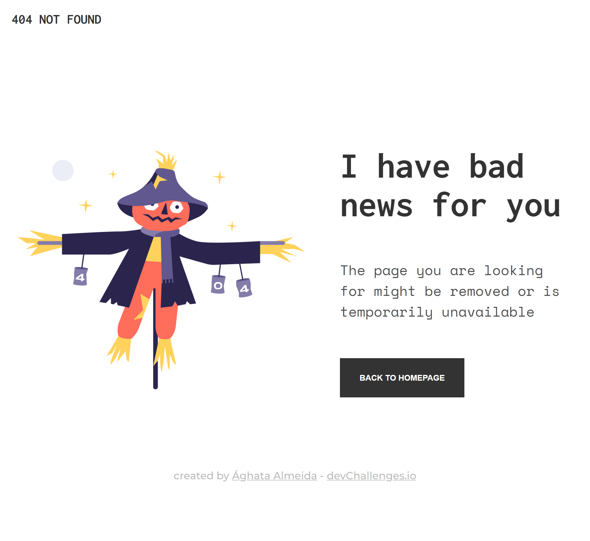
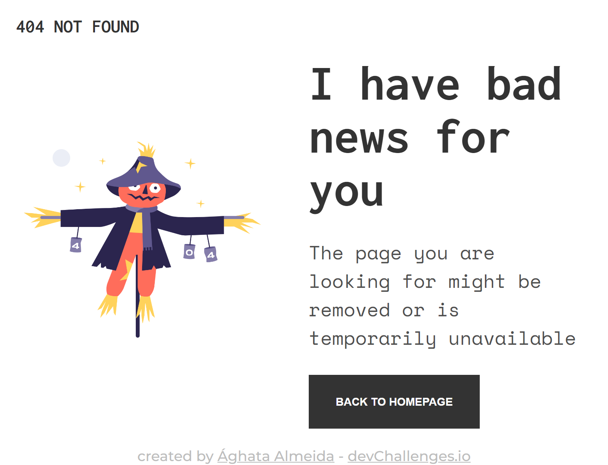
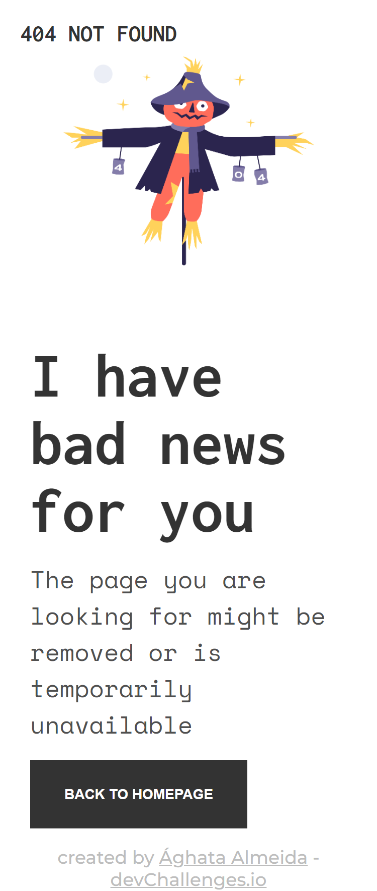

<!-- Please update value in the {}  -->

<h1 align="center">Página de erro 404</h1>

   Solução para um desafio de <a href="http://devchallenges.io" target="_blank">Devchallenges.io</a>.

  <h3>
    <a href="https://https://404-page-dev-challenges.vercel.app/" target="_blank" >
      Preview
    </a>
     | 
    <a href="https://devchallenges.io/challenges/wBunSb7FPrIepJZAg0sY"  target="_blank" >
      Desafio
    </a>
  </h3>

<!-- TABLE OF CONTENTS -->

## Índice

- [Visão geral](#visão-geral)
- [Ferramentas](#ferramentas)
- [Contato](#contato)

<!-- OVERVIEW -->

## Visão geral

Desktop Version:

Tablet Version:

Mobile Version:

### Ferramentas

<!-- This section should list any major frameworks that you built your project using. Here are a few examples.-->

- HTML
- CSS
- [SASS](https://sass-lang.com/)

## Contato

- Linkedin (https://www.linkedin.com/in/aghata-almeida/)
